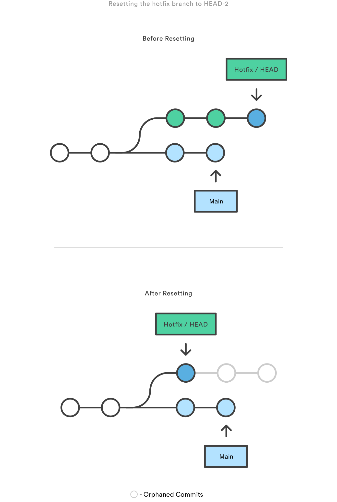

### Resetting a Specific Commit

At the commit level, `git reset` moves the tip of a branch to a specified commit, effectively removing any later commits. For example, to move the `hotfix` branch back by two commits:

```bash
git checkout hotfix
git reset HEAD~2
```

<center>

</center>

This command leaves the last two commits "dangling" (orphaned). They will be deleted during Git's garbage collection, essentially discarding those changes. This method is ideal for undoing work that hasn't been shared or pushed.

#### Reset Modes

The `git reset` command offers different modes to control how the staged snapshot and working directory are handled:

- **`--soft`**: Only moves the branch tip. The staged snapshot and working directory remain unchanged.
- **`--mixed`** (default): Moves the branch tip and updates the staged snapshot, but leaves the working directory intact.
- **`--hard`**: Moves the branch tip, updates the staged snapshot, and resets the working directory to match the specified commit (deletes all changes).

These options define the scope of the reset, making it easy to adjust the level of changes we want to discard or keep.
