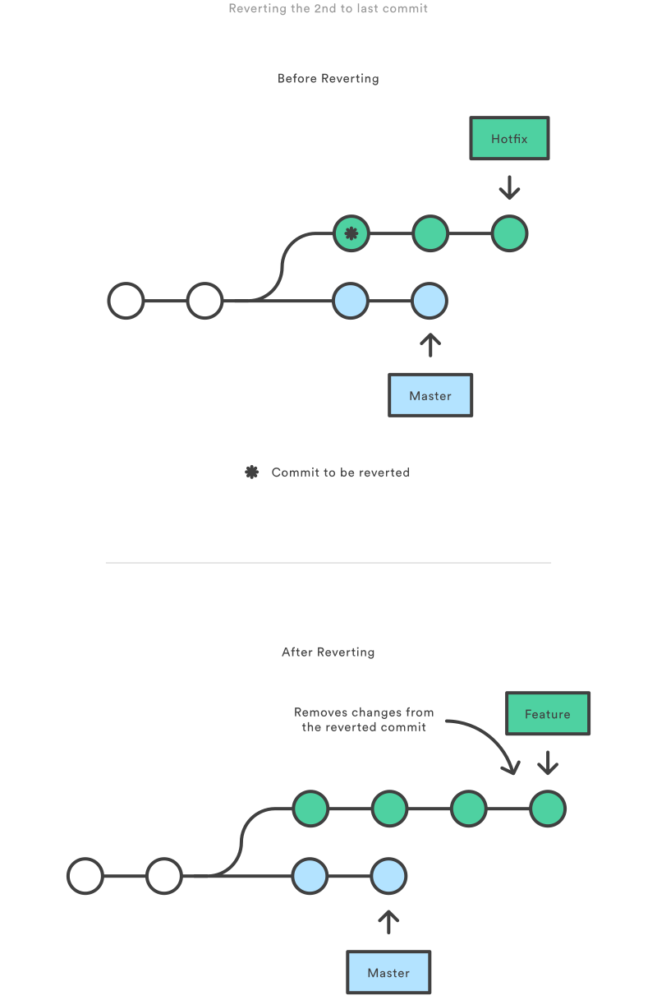

### Undo Public Commits with `git revert`

`git revert` safely undoes a commit by creating a new commit that reverses the changes introduced by a previous one. This method is ideal for undoing commits on public branches because it doesn't rewrite commit history. Instead, it appends a new commit that reverses the specified changes.

For example, to undo the 2nd-to-last commit on the `hotfix` branch:

```bash
git checkout hotfix
git revert HEAD~2
```

<center>

</center>

This command identifies the changes in the specified commit (`HEAD~2`), creates a new commit that reverses those changes, and adds it to the current branch.

#### Why Use `git revert` Over `git reset`

- **`git revert`** creates a new commit that preserves history, making it safe for public branches where rewriting history can cause problems for collaborators.
- **`git reset`** alters commit history by moving the branch tip to an earlier commit, which is risky on public branches but useful for private ones where rewriting history is acceptable.

#### When to Use `git revert` vs. `git reset`

- **`git revert`**: Use this to undo committed changes on a public branch without affecting the history.
- **`git reset`**: Use this to undo uncommitted changes or remove commits on a private branch where history rewriting is safe.

#### Caution: Overwriting Files

Like `git checkout`, `git revert` may overwrite files in the working directory. Git will prompt to commit or stash changes before proceeding if the revert would cause any uncommitted changes to be lost.

`git revert` is a safe and reliable way to manage public branches by ensuring the project’s history remains intact while selectively undoing changes.
